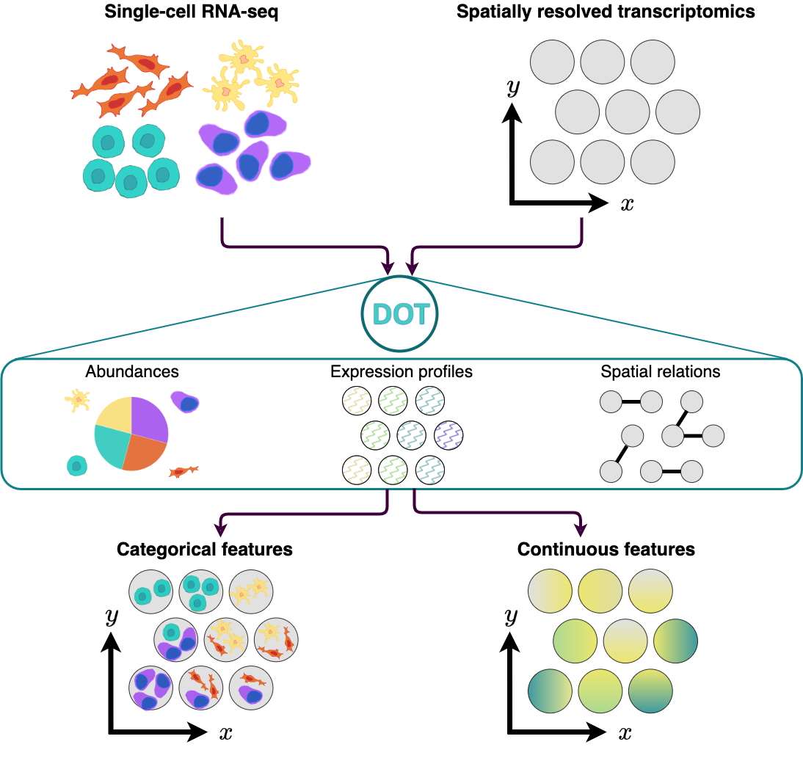

# DOT: Flexible Feature Transfer to Spatial Omics 

<!-- badges: start -->
[](https://github.com/saezlab/DOT/actions/workflows/R-CMD-check.yaml)
[](https://github.com/saezlab/DOT/issues)

<!-- badges: end -->

## Overview

`DOT` is a method for transferring cell features from a reference single-cell RNA-seq data to spots/cells in spatial omics. It operates by optimizing a combination of multiple objectives using a Frank-Wolfe algorithm to produce a high quality transfer. Apart from transferring cell types/states to spatial omics, `DOT` can be used for transferring other relevant categorical or continuous features from one set of omics to another, such as estimating the expression of missinng genes or transferring transcription factor/pathway activities.


<p align="center" width="100%">
    
</p>

For more information about how this package has been used with real data and expected outputs, please check the following link:

- [DOT's general usage](https://saezlab.github.io/DOT/articles/general.html)

## Installation
`DOT` is an R package which you can install from [GitHub](https://github.com/) with:

```r
devtools::install_github("saezlab/DOT")
```

## Dependencies

-   R (>= 4.0)
-   R packages: fields, ggplot2, Matrix, methods, Seurat, stats, stringr

For optimal performance on moderately sized instances, we recommend at least 4 GB of RAM. For large reference scRNA-seq data or very large spatial instances higher memory may be required.

Installation takes less than five minutes. The sample dataset provided can be run in less than a minute on a "normal" desktop computer. DOT takes approximately 7 minutes to process a MERFISH MOp dataset with approximately 250 genes, 100 cell types and 4,000 spots.

Operating system tested on: macOS Monterey 12.4

## Citation
If you use **DOT** for your research please cite the [following preprint](https://arxiv.org/abs/2301.01682): 

> Rahimi, Arezou, Luis A. Vale-Silva, Maria Faelth Savitski, Jovan Tanevski, and Julio Saez-Rodriguez. "DOT: A flexible multi-objective optimization framework for transferring features across single-cell and spatial omics." arXiv preprint arXiv:2301.01682 (2023).
