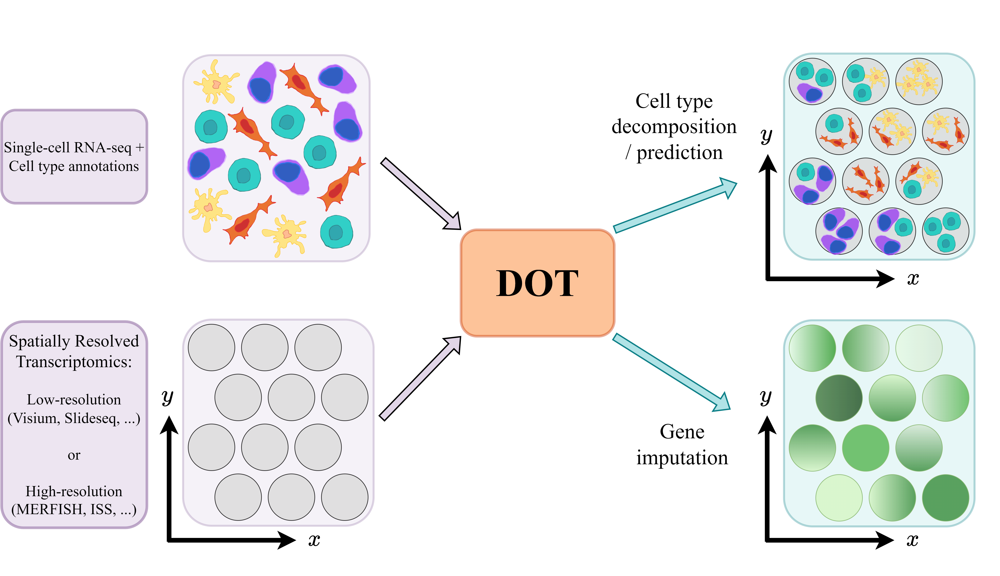

# DOT: A flexible multi-objective optimization framework for transferring features across single-cell and spatial omics 

<!-- badges: start -->
[](https://github.com/saezlab/DOT/actions)
[](https://github.com/saezlab/DOT/issues)

<!-- badges: end -->

## Overview

`DOT` is a method for transferring cell features from a reference single-cell RNA-seq data to spots/cells in spatial omics. It operates by optimizing a combination of multiple objectives using a Frank-Wolfe algorithm to produce a high quality transfer. Apart from transferring cell types/states to spatial omics, `DOT` can be used for transferring other relevant categorical or continuous phenotypes from one set of omics to another, such as estimating the expression of missinng genes or transferring transcription factor/pathway activities.
<p align="center" width="100%">
    
</p>

For more information about how this package has been used with real data, please check the following links:

- [DOT's general usage](articles/DOT.md)

# Installation
`DOT` is an R package which you can install from [GitHub](https://github.com/) with:

```{r github_install, eval=FALSE}
library(devtools)
devtools::install_github("saezlab/DOT")
```

## Citation
If you use **DOT** for your research please cite the [following preprint](https://arxiv.org/abs/2301.01682): 

> Rahimi, Arezou, Luis A. Vale-Silva, Maria Faelth Savitski, Jovan Tanevski, and Julio Saez-Rodriguez. "DOT: A flexible multi-objective optimization framework for transferring features across single-cell and spatial omics." arXiv preprint arXiv:2301.01682 (2023).
