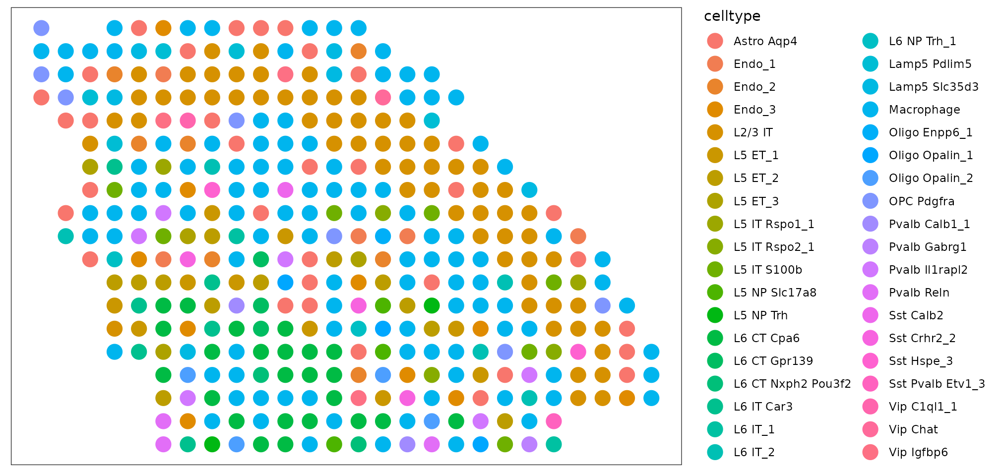
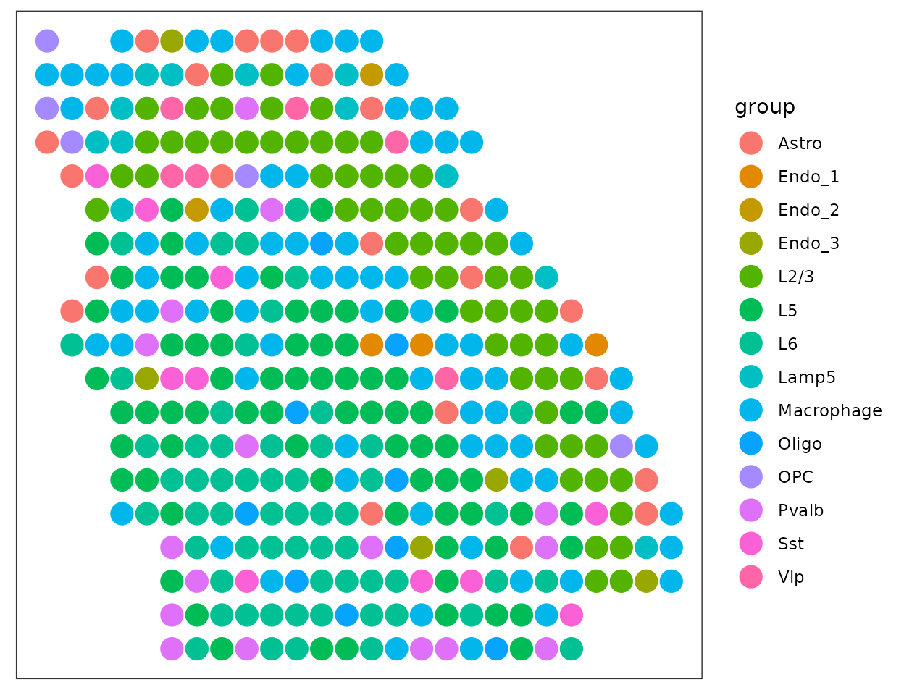

# DOT: A flexible multi-objective optimization framework for transferring features across single-cell and spatial omics

## Setup

``` r
# dot
library(DOTr)

# for plotting
library(ggplot2)
```

The following example illustrates how DOT is used for inferring cell
type composition of spots in a synthetic multicell spatial data of the
primary motor cortex region (MOp) of the mouse brain. The reference
single-cell RNA seq sample comes from a similar region and contains 44
cell types. Both spatial and single-cell data are down-sampled to 500
genes in this example.

``` r
data(dot.sample)

# gene x cell
dim(dot.sample$ref$counts)
#> [1]   500 20385

ggplot(as.data.frame(sort(table(dot.sample$ref$labels), decreasing = T)), aes(x = Var1, y = Freq))+
  geom_bar(stat="identity", fill="steelblue")+
  xlab("")+ylab("")+theme_bw()+
  theme(panel.background = element_rect(fill = 'white'), 
        panel.grid = element_blank(),
        axis.text.x = element_text(angle = 90, vjust = 0.5, hjust=1))
```


``` r
# gene x spot
dim(dot.sample$srt$counts)
#> [1] 500 361

plot_data <- dot.sample$srt$coordinates
ggplot(plot_data, aes(x = Col, y = Row))+
  geom_point(size = 5)+
  theme_bw()+
  theme(panel.background = element_rect(fill = 'white'), 
        panel.grid = element_blank(),
        axis.text = element_blank(), 
        axis.title = element_blank(), 
        axis.ticks = element_blank())
```


## Decomposition

The first step of `DOT` is to set up a DOT object. `DOT` takes two main
inputs:

- `ref_data` is either a `matrix`, `dgMatrix`, or `data.frame` or a
  `Seurat`/`anndata` object containing the gene x cell count matrix for
  the reference single-cell data.

- If `ref_data` is a `matrix`, `dgMatrix`, or `data.frame`, then
  `ref_annotations` must be supplied as a 1-dimensional vector of cell
  annotations.

- If `ref_data` is a `Seurat` or an `anndata` object, then
  `ref_annotations` can be either a 1-dimensional vector of cell
  annotations, a `character` indicating the `ident`/`obs` contained
  therein, or can be `NULL` in which case annotations are extracted from
  the object.

- `srt_data` is likewise either a `matrix`, `dgMatrix`, or `data.frame`
  or a `Seurat`/`anndata` object containing the gene x spot/cell count
  matrix for the target spatial data.

- If `srt_data` is a `matrix`, `dgMatrix`, or `data.frame`, then
  `srt_coords` must be supplied as a 2 x spot matrix of locations.

- If `srt_data` is a `Seurat` or an `anndata` object, then `srt_coords`
  can be either 2 x spot matrix of locations or can be `NULL` in which
  case locations are extracted from the object.

In the following example, we supply the count matrices as `dgMatrix`
objects and supply the annotations/locations explicitly.

``` r
dot.srt <- setup.srt(srt_data = dot.sample$srt$counts, srt_coords = dot.sample$srt$coordinates)
dot.ref <- setup.ref(ref_data = dot.sample$ref$counts, ref_annotations = dot.sample$ref$labels, 10)

dot <- create.DOT(dot.srt, dot.ref)
```

We are now ready to perform decomposition:

``` r
dot <- run.DOT.lowresolution(dot,  # The DOT object created above
                             ratios_weight = 0,       # Abundance weight; a larger value more closely matches the abundance of cell types in the spatial data to those in the reference data
                             max_spot_size = 20, # Maximum size of spots (20 is usually sufficiently large for Visium slides) 
                             verbose = FALSE)

dim(dot@weights)
#> [1] 361  44
```

## Plotting

The output of DOT is contained in `dot@weights` which has spots as rows
and cell types as columns, with each row denoting the cell type
composition of the respective spot. A simple way of illustrating the
cell type map is to annotate the spots based on the label of the most
likely cell type.

Cell type map at the given annotation level:

``` r
plot_data <- dot.sample$srt$coordinates
plot_data$celltype <- colnames(dot@weights)[apply(dot@weights, 1, which.max)]
ggplot(plot_data, aes(x = Col, y = Row, color = celltype))+
  geom_point(size = 5)+
  theme_bw()+
  theme(panel.background = element_rect(fill = 'white'), 
        panel.grid = element_blank(),
        axis.text = element_blank(), 
        axis.title = element_blank(), 
        axis.ticks = element_blank())
```



Cell type map at a higher annotation level:

``` r
groups <- sapply(colnames(dot@weights), function(x) stringr::str_split(x, " ")[[1]][1])
agg_weights <- t(rowsum(t(dot@weights), groups))
plot_data$group <- colnames(agg_weights)[apply(agg_weights, 1, which.max)]

ggplot(plot_data, aes(x = Col, y = Row, color = group))+
  geom_point(size = 5)+
  theme_bw()+
  theme(panel.background = element_rect(fill = 'white'), 
        panel.grid = element_blank(),
        axis.text = element_blank(), 
        axis.title = element_blank(), 
        axis.ticks = element_blank())
```


