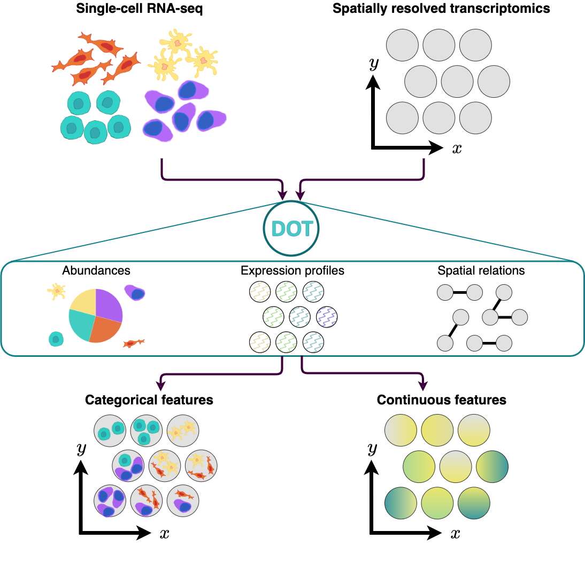

# DOT: Flexible Feature Transfer to Spatial Omics 

\## Overview

`DOT` is a method for transferring cell features from a reference
single-cell RNA-seq data to spots/cells in spatial omics. It operates by
optimizing a combination of multiple objectives using a Frank-Wolfe
algorithm to produce a high quality transfer. Apart from transferring
cell types/states to spatial omics, `DOT` can be used for transferring
other relevant categorical or continuous features from one set of omics
to another, such as estimating the expression of missinng genes or
transferring transcription factor/pathway activities.



For more information about how this package has been used with real data
and expected outputs, please check the following link:

- [DOT’s general
  usage](https://saezlab.github.io/DOT/articles/general.html)

## Installation

`DOT` is available under the R package `DOTr` which you can install from
[GitHub](https://github.com/) with:

``` r
devtools::install_github("saezlab/DOT")
```

## Dependencies

- R (\>= 4.0)
- R packages: fields, ggplot2, Matrix, methods, Seurat, stats, stringr

For optimal performance on moderately sized instances, we recommend at
least 4 GB of RAM. For large reference scRNA-seq data or very large
spatial instances higher memory may be required.

Installation takes less than five minutes. The sample dataset provided
can be run in less than a minute on a “normal” desktop computer. DOT
takes approximately 7 minutes to process a MERFISH MOp dataset with
approximately 250 genes, 100 cell types and 4,000 spots.

Operating system tested on: macOS Monterey 12.4

## Python version

Erick Armignol (<https://github.com/earmingol>) has implemented a native
Python version of DOT, supporting also deployment on GPUs.

Check out <https://github.com/earmingol/DOTpy> for information on how to
install it, examples of use and more practical tips.

Thank you Erick!

## Citation

If you use **DOT** for your research please cite the [following
article](https://doi.org/10.1038/s41467-024-48868-z):

> Rahimi, A., Vale-Silva, L.A., Fälth Savitski, M. et al. DOT: a
> flexible multi-objective optimization framework for transferring
> features across single-cell and spatial omics. Nat Commun 15, 4994
> (2024). <https://doi.org/10.1038/s41467-024-48868-z>.
